# PawPal+ (from Module 2)

## Summary

PawPal+ is a pet care planning app that helps owners organize daily responsibilities, track task progress, and build workable schedules for one or more pets. It groups care activities by priority, time of day, and recurrence so important tasks are completed on time and routine care is easier to manage.

This matters because pet care has many repeated tasks with different timing needs. By reducing missed tasks, conflicts, and manual planning, the app supports more consistent care and makes pet ownership simpler and more reliable.

## Architecture Overview

<a href="UML's/UML.png" target="_blank"></a>

This UML diagram summarizes the main classes and relationships: Owner aggregates Pets, each Pet aggregates Tasks, and the Scheduler coordinates task selection, conflict detection, and recurrence generation. It highlights key data flows (task creation → status transitions → recurring task generation) and separation of concerns between scheduling logic and persistence/validation.


## Getting started

### Setup

1. **Create virtual environment:** `python -m venv .venv`

2. **Activate virtual environment:**
   - **Linux/macOS:** `source .venv/bin/activate`
   - **Windows (PowerShell):** `.venv\Scripts\Activate.ps1`
   - **Windows (CMD):** `.venv\Scripts\activate.bat`

3. **Install dependencies:** `pip install -r requirements.txt`

4. **Run the app:** `python -m streamlit run app.py`


## 🎯 Design Decisions

**Why composition over inheritance:** Owner → Pet → Task hierarchy uses composition because pets share responsibilities but aren't strict subtypes. This lets us modify task rules without touching pet logic.

**Task status system (pending/in-progress/completed):** Started with a simple boolean (`completed`), but real scheduling needs intermediate states. The 3-state model tracks workflow better and handles edge cases like tasks interrupted mid-execution.

**Scheduler as coordinator:** Rather than embedding scheduling logic inside Owner or Pet, a separate Scheduler class keeps concerns isolated. Trade-off: extra class complexity, but gained testability and flexibility to swap algorithms.

**Filtering before sorting:** The Scheduler first filters by time constraints, then sorts by priority. This prevents attempting impossible schedules. Trade-off: slightly less flexible (can't override time constraints), but more predictable and harder to break.


## Testing PawPal+

Run the automated test suite:

```bash
python -m pytest tests/test_pawpal.py -v
```

### Test Results

✅ **51/51 tests PASSED** - 100% coverage of core functions (Task, Pet, Owner, Scheduler)

### Test Summary

**✅ What Worked:**
- Task lifecycle (pending → in-progress → completed) validated correctly
- Pet & Owner management (add/remove operations, duplicate prevention)
- Scheduler filtering, sorting, and conflict detection
- Recurring task generation (daily/weekly/monthly patterns)
- Input validation and error handling across all operations

**⚡ Future Enhancements:**
- Deepen RAG summarizer integration for smarter task recommendations

**📚 What I Learned:**
- Comprehensive validation at each layer prevents cascading errors
- Edge cases (empty lists, boundary times) need explicit handling
- Type checking is critical for system stability with multiple pet/task combinations


## Reflection

This project taught me that real-world problems improve through iteration: my task system started simple but evolved into a 3-state model because real constraints demanded it. AI works best with clean data and clear structure; without it, even smart models fail. Breaking pet care into components (Owner → Pet → Task → Scheduler) made everything easier to test and fix, while scheduling logic revealed that good solutions are really about balancing what matters most with what's actually possible.


## 📸 Sample Interactions

### User Interface Overview

<div style="display: flex; gap: 20px; justify-content: center; flex-wrap: wrap;">
  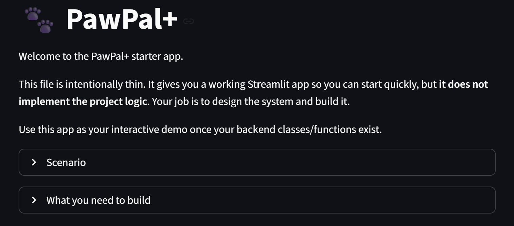
  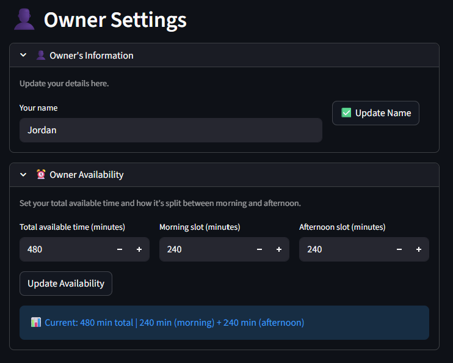
</div>

<div style="display: flex; gap: 20px; justify-content: center; flex-wrap: wrap;">
  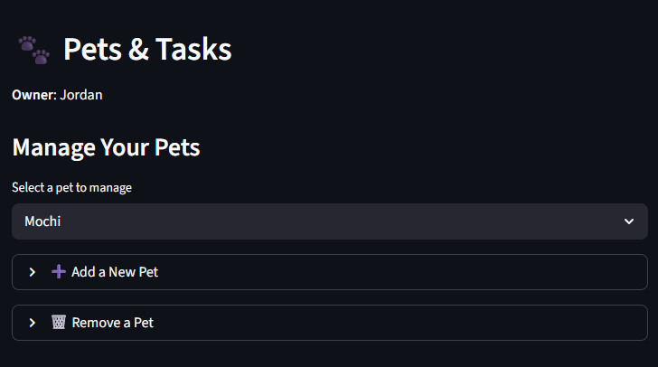
  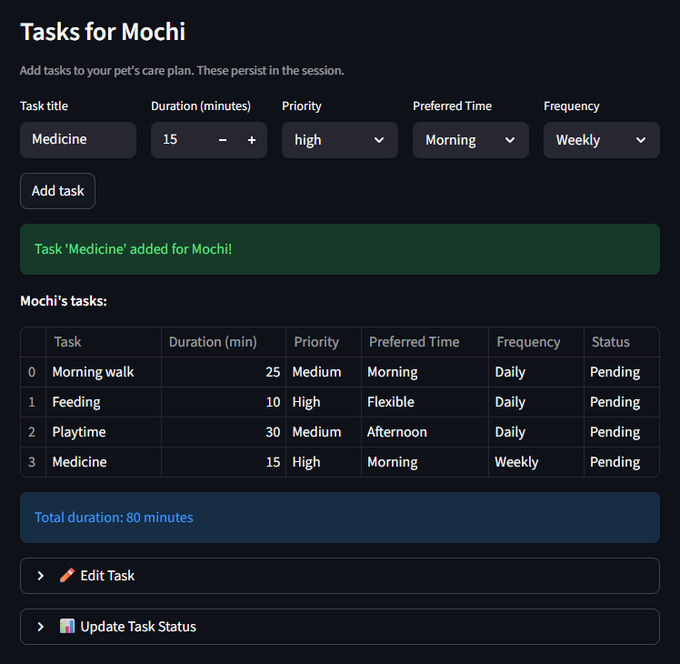
</div>

<div style="display: flex; gap: 20px; justify-content: center;">
  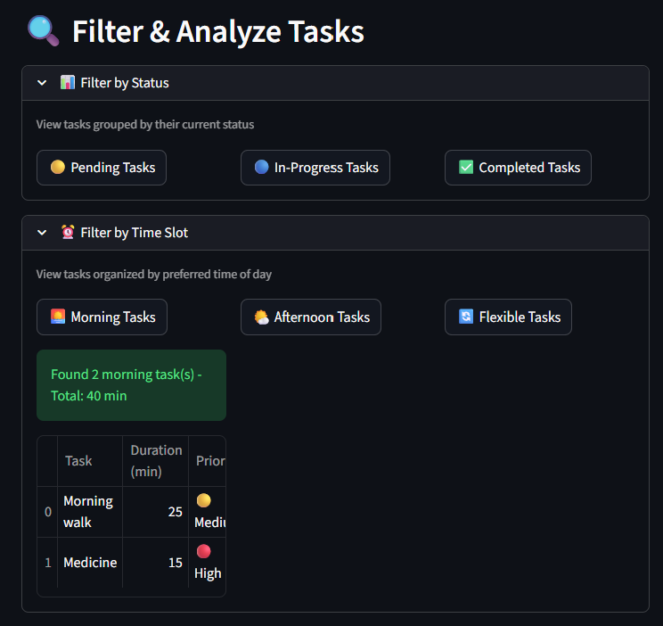
</div>

### Scheduler in Action

<div style="display: flex; gap: 20px; justify-content: center;">
  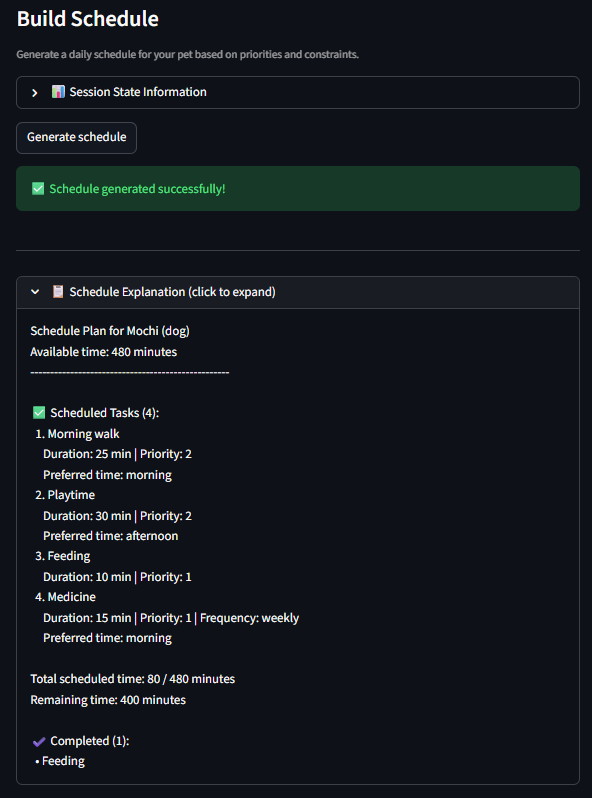
  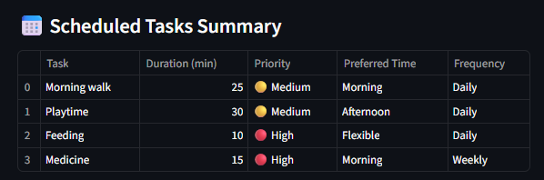
</div>

### AI Pet Summaries (RAG)

**AI Configuration:**

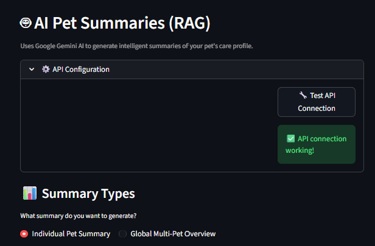

**Individual Pet Summary:**

<div style="display: flex; gap: 20px; justify-content: center;">
  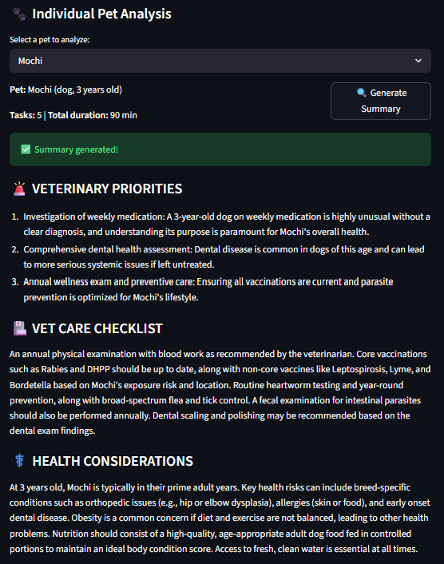
  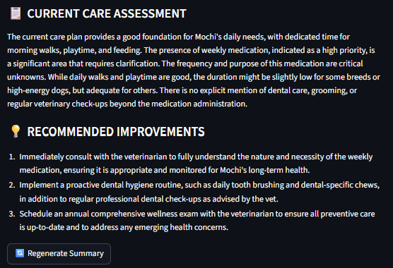
</div>

**Global Multi-Pet Summary:**

<div style="display: flex; gap: 20px; justify-content: center;">
  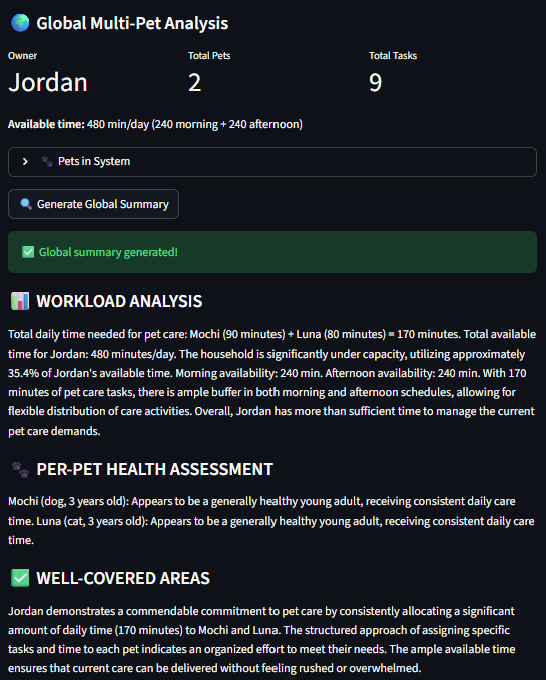
  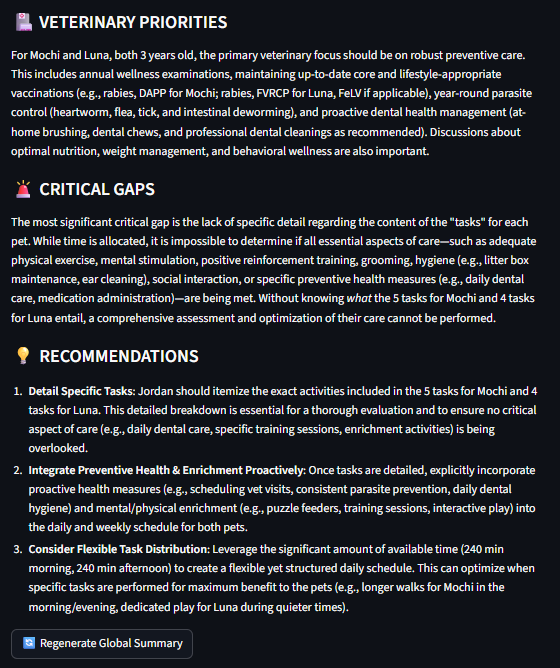
</div>

